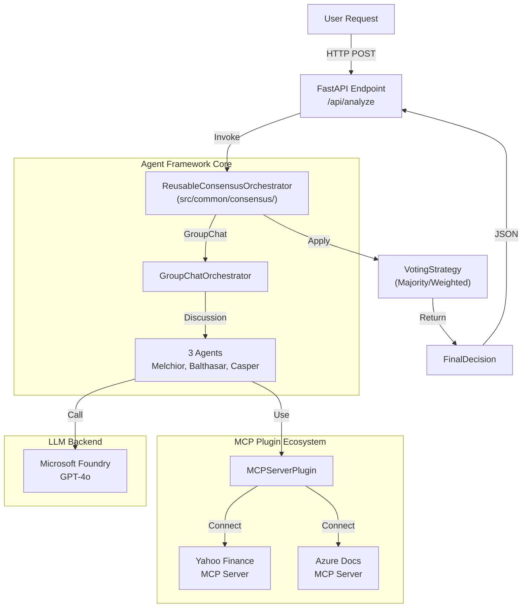

# Technical Design: Stock Magi System (Japanese Edition)

## 🎯 Design Philosophy

**「最小限のコードで最大限の再利用性」**

本システムは、**Microsoft Agent Framework** をベースに、株式以外のドメインにも流用可能な **汎用マルチエージェント合議基盤** を構築します。
- **コード削減**: フルスクラッチ実装(1,500行) → Agent Framework活用(300-500行) = **70%削減**
- **再利用性**: 共通基盤(`src/common/`)を他ドメイン(不動産、医療など)にそのまま適用可能
- **教育価値**: Microsoft公式フレームワークのベストプラクティスを学習

---

## 1. System Architecture

### 1.1 High-Level Overview



### 1.2 Architecture Layers

#### Layer 1: Common Framework (Reusable)
**目的**: ドメイン非依存な汎用マルチエージェント基盤

```
src/common/
├── consensus/
│   ├── orchestrators/
│   │   └── group_chat_consensus.py      # 汎用GroupChat合議エンジン
│   └── strategies/
│       ├── voting_strategy.py           # 多数決/重み付け投票
│       └── confidence_aggregation.py    # 信頼度ベース集約
├── mcp/
│   ├── plugin_registry.py               # MCPプラグイン統一管理
│   └── data_source_adapter.py           # 汎用データソースアダプター
└── models/
    └── decision_models.py               # 共通データモデル(Action, Decision)
```

**再利用パターン**:
- 不動産分析: `src/real_estate/` を追加、`src/common/` はそのまま流用
- 医療診断: `src/medical/` を追加、合議エンジンを再利用

#### Layer 2: Stock Domain (Domain-Specific)
**目的**: 株式分析に特化したエージェント定義とプロンプト

```
src/stock_magi/
├── agents/
│   ├── melchior_agent.py                # ファンダメンタルズ分析ペルソナ
│   ├── balthasar_agent.py               # バランス分析ペルソナ
│   └── casper_agent.py                  # テクニカル分析ペルソナ
├── prompts/
│   └── stock_analysis_prompts.py        # 株式分析用プロンプトテンプレート
└── api/
    └── endpoints.py                     # FastAPI エンドポイント
```

#### Layer 3: Infrastructure
**目的**: デプロイ・設定管理

```
infra/
├── main.bicep                           # Azure Container Apps定義
└── config/
    └── mcp_servers.json                 # MCP サーバー設定
```

---

## 2. Core Components

### 2.1 Reusable Consensus Orchestrator

**ファイル**: `src/common/consensus/orchestrators/group_chat_consensus.py`

```python
# ⚠️ Agent Framework プレリリース版使用時の注意:
# - pyproject.toml でバージョン固定: agent-framework-azure-ai = "1.0.0b251223"
# - Microsoft Foundry Portal (https://ai.azure.com/) で GUI ベースのモデル管理を併用
# - DevUI (agent-framework DevUI パッケージ) でエージェント動作のビジュアルデバッグ

from agent_framework import GroupChatOrchestrator, Agent
from typing import List, Dict, Any
from ..strategies.voting_strategy import VotingStrategy

class ReusableConsensusOrchestrator:
    """
    ドメイン非依存の汎用マルチエージェント合議エンジン

    使用例:
      - 株式分析: 3エージェント(Melchior, Balthasar, Casper)で Buy/Sell/Hold判定
      - 不動産分析: 3エージェント(Location, Finance, Risk)で投資判定
      - 医療診断: 3エージェント(Radiology, Pathology, Clinical)で診断支援
    """

    def __init__(
        self,
        agents: List[Agent],
        voting_strategy: VotingStrategy,
        max_turns: int = 5
    ):
        self.agents = agents
        self.voting_strategy = voting_strategy
        self.orchestrator = GroupChatOrchestrator(
            agents=agents,
            max_turns=max_turns
        )

    async def reach_consensus(self, input_context: Dict[str, Any]) -> Dict[str, Any]:
        """
        汎用合議実行

        Args:
            input_context: ドメイン固有のコンテキスト(例: {"ticker": "7203.T"})

        Returns:
            FinalDecision: 最終判断 + 討論履歴
        """
        # Step 1: GroupChatで討論
        discussion_result = await self.orchestrator.run(input_context)

        # Step 2: 投票戦略で最終判断
        final_decision = self.voting_strategy.aggregate(discussion_result)

        return {
            "decision": final_decision,
            "discussion_history": discussion_result.messages,
            "individual_votes": [msg.content for msg in discussion_result.messages]
        }
```

### 2.2 Stock Domain Agents

**ファイル**: `src/stock_magi/agents/melchior_agent.py`

```python
from agent_framework import Agent
from agent_framework.plugins.mcp import MCPServerPlugin

def create_melchior_agent(mcp_plugin: MCPServerPlugin) -> Agent:
    """
    Melchior: ファンダメンタルズ分析重視の保守的エージェント

    ペルソナ:
      - NERV MAGI System の科学者人格
      - 財務諸表、PER/PBR、ニュースセンチメントを重視
      - リスク回避的な判断傾向
    """
    return Agent(
        name="Melchior",
        system_message="""
        あなたは株式アナリストのMelchiorです。

        **分析方針**:
        - ファンダメンタルズ分析を最重視
        - 財務諸表(PER, PBR, ROE)の健全性を確認
        - ニュースセンチメントで市場心理を補完
        - 保守的な判断(リスク回避)

        **出力形式**:
        1. 判断: BUY/SELL/HOLD
        2. 信頼度: 0.0-1.0
        3. 根拠: 財務指標とニュースの要約
        """,
        plugins=[mcp_plugin]  # Yahoo Finance MCP で株価・財務データ取得
    )
```

**同様に**: `balthasar_agent.py` (バランス分析), `casper_agent.py` (テクニカル分析)

### 2.3 MCP Plugin Registry

**ファイル**: `src/common/mcp/plugin_registry.py`

```python
from agent_framework.plugins.mcp import MCPServerPlugin
from typing import Dict, List
import json

class MCPPluginRegistry:
    """
    複数MCPサーバーを統一管理する汎用レジストリ

    対応データソース:
      - Morningstar (PER, PBR, ROE など詳細財務指標) - **MVP (Phase 1)** - Foundry Tool Catalog
      - Yahoo Finance (株価チャート、リアルタイムデータ) - **Phase 2** - npm MCP Server
      - Azure Docs (クラウドナレッジ) - **Phase 2**
      - DuckDB (ローカルデータベース) - **Phase 3**

    注意: Morningstar は Foundry Tool Catalog から直接利用可能。
         Phase 1 では Foundry Portal (https://ai.azure.com/) で GUI 設定するのみ。
    """

    def __init__(self, config_path: str = "config/mcp_servers.json"):
        self.plugins: Dict[str, MCPServerPlugin] = {}
        self._load_config(config_path)

    def _load_config(self, path: str):
        """設定ファイルからMCPサーバー情報を読み込み"""
        with open(path) as f:
            config = json.load(f)

        for name, server_config in config.items():
            self.plugins[name] = MCPServerPlugin(
                server_command=server_config["command"],
                args=server_config.get("args", [])
            )

    def get_plugin(self, name: str) -> MCPServerPlugin:
        """名前でMCPプラグインを取得"""
        return self.plugins[name]

    def get_plugins_for_agent(self, agent_type: str) -> List[MCPServerPlugin]:
        """エージェント種別に応じたMCPプラグインセットを返す"""
        # 例: Melchiorは Yahoo Finance のみ、将来的に Azure Docs 追加
        mapping = {
            "melchior": ["yahoo_finance"],
            "balthasar": ["yahoo_finance", "azure_docs"],
            "casper": ["yahoo_finance"]
        }
        return [self.plugins[name] for name in mapping.get(agent_type, [])]
```

---

## 3. Data Contracts

### 3.1 Common Domain Models

**ファイル**: `src/common/models/decision_models.py`

```python
from enum import Enum
from pydantic import BaseModel, Field
from datetime import datetime
from typing import List

class Action(str, Enum):
    """汎用アクション型（ドメイン非依存）"""
    BUY = "BUY"
    SELL = "SELL"
    HOLD = "HOLD"
    # 他ドメイン用: APPROVE, REJECT, DEFER など追加可能

class AgentVote(BaseModel):
    """個別エージェントの投票"""
    agent_name: str
    action: Action
    confidence: float = Field(ge=0.0, le=1.0)
    reasoning: str
    timestamp: datetime = Field(default_factory=datetime.now)

class FinalDecision(BaseModel):
    """合議による最終判断"""
    decision: Action
    confidence: float
    summary: str
    vote_breakdown: dict  # {BUY: 2, SELL: 0, HOLD: 1}
    individual_votes: List[AgentVote]
    executed_at: datetime = Field(default_factory=datetime.now)
```

### 3.2 API Schema

**Endpoint**: `POST /api/analyze`

**Request**:
```json
{
  "ticker": "7203.T",
  "strategy": "STANDARD"  // Optional: "WEIGHTED"
}
```

**Response**:
```json
{
  "decision": "BUY",
  "confidence": 0.85,
  "summary": "MelchiorとBalthasarが好材料と判断。Casperは慎重だが反対ではない。",
  "vote_breakdown": {"BUY": 2, "SELL": 0, "HOLD": 1},
  "individual_votes": [
    {
      "agent_name": "Melchior",
      "action": "BUY",
      "confidence": 0.9,
      "reasoning": "PERが15と割安。営業利益率改善傾向。"
    }
  ]
}
```

---

## 4. Implementation Stack

### 4.1 Technology Choices

| Component | Technology | Rationale |
|-----------|-----------|-----------||
| **Language** | Python 3.11+ | Agent Framework の最新機能が豊富 |
| **Framework** | Microsoft Agent Framework (⚠️ v1.0.0b251223) | Multi-Agent/MCP ネイティブサポート（バージョン固定） |
| **API** | FastAPI | 高速、非同期、自動OpenAPI生成 |
| **LLM** | Microsoft Foundry (GPT-4o) | モデル管理、コスト追跡、プロンプト実験 |
| **MCP** | Agent Framework MCP Plugin | ネイティブMCP統合 |
| **Deploy** | Azure Container Apps | Python対応、Auto-scaling、低コスト |
| **Testing** | pytest + pytest-asyncio | Python標準、Agent Framework 互換 |
| **Linter** | Ruff | 超高速 Linter + Formatter |
| **GUI管理** | Microsoft Foundry Portal + DevUI | プレリリース版リスク軽減 |

### 4.2 Folder Structure

```
stock-magi-system/
├── src/
│   ├── common/                          # 汎用基盤（再利用可能）
│   │   ├── consensus/
│   │   │   ├── orchestrators/
│   │   │   │   └── group_chat_consensus.py
│   │   │   └── strategies/
│   │   │       ├── voting_strategy.py
│   │   │       └── confidence_aggregation.py
│   │   ├── mcp/
│   │   │   ├── plugin_registry.py
│   │   │   └── data_source_adapter.py
│   │   └── models/
│   │       └── decision_models.py
│   ├── stock_magi/                      # 株式ドメイン固有
│   │   ├── agents/
│   │   │   ├── melchior_agent.py
│   │   │   ├── balthasar_agent.py
│   │   │   └── casper_agent.py
│   │   ├── prompts/
│   │   │   └── stock_analysis_prompts.py
│   │   └── api/
│   │       └── endpoints.py
│   └── main.py                          # FastAPI アプリエントリーポイント
├── tests/
│   ├── common/                          # 共通基盤のテスト
│   │   ├── test_consensus.py
│   │   └── test_mcp_registry.py
│   └── stock_magi/                      # ドメイン固有のテスト
│       ├── test_agents.py
│       └── test_api.py
├── infra/
│   └── main.bicep                       # Azure インフラ定義
├── config/
│   └── mcp_servers.json                 # MCP サーバー設定
├── pyproject.toml                       # Poetry 依存管理
├── Dockerfile
└── README.md
```

---

## 5. Security & Configuration

### 5.1 Environment Variables

```.env
# Microsoft Foundry (旧 Azure AI Foundry)
FOUNDRY_ENDPOINT=https://your-project.azure.ai.foundry.microsoft.com
FOUNDRY_API_KEY=<Key Vault参照>
FOUNDRY_DEPLOYMENT=gpt-4o

# MCP Servers (ローカル開発用)
MCP_YAHOO_FINANCE_COMMAND=npx @modelcontextprotocol/server-yahoo-finance
MCP_AZURE_DOCS_COMMAND=npx @modelcontextprotocol/server-azure-docs
```

### 5.2 MCP Server Configuration

**ファイル**: `config/mcp_servers.json`

```json
{
  "yahoo_finance": {
    "command": "npx",
    "args": ["@modelcontextprotocol/server-yahoo-finance"]
  },
  "azure_docs": {
    "command": "npx",
    "args": ["@modelcontextprotocol/server-azure-docs"]
  }
}
```

### 5.3 Authentication
- **MVP**: FastAPI Basic Auth または API Key
- **Phase 2**: Azure AD (Entra ID) 統合

---

## 6. Testing Strategy

### 6.1 Unit Testing
- **対象**: `src/common/consensus/`, `src/common/mcp/`
- **方針**: Agent Framework のモックを使用、LLM呼び出しなし
- **ツール**: pytest + unittest.mock

```python
# tests/common/test_consensus.py
import pytest
from unittest.mock import AsyncMock
from src.common.consensus.orchestrators import ReusableConsensusOrchestrator

@pytest.mark.asyncio
async def test_consensus_majority_vote():
    """多数決投票のテスト"""
    # Mock agents
    mock_agents = [AsyncMock(name=f"Agent{i}") for i in range(3)]
    orchestrator = ReusableConsensusOrchestrator(
        agents=mock_agents,
        voting_strategy="majority"
    )

    result = await orchestrator.reach_consensus({"ticker": "TEST"})
    assert result["decision"] in ["BUY", "SELL", "HOLD"]
```

### 6.2 Integration Testing
- **対象**: FastAPI エンドポイント + Agent Framework連携
- **方針**: ローカルMCPサーバー（Dockerコンテナ）と実連携
- **ツール**: pytest + TestClient (FastAPI)

---

## 7. Educational Goals

### 7.1 Learning Objectives
1. **Agent Framework**: Multi-Agent Orchestration の実践
2. **MCP Protocol**: データソース統合の標準化
3. **Microsoft Foundry**: モデル管理とプロンプト最適化
4. **Python Async**: async/await の効果的な使用
5. **再利用設計**: ドメイン非依存なモジュール設計

### 7.2 Documentation Plan
- `docs/AGENT_FRAMEWORK_GUIDE.md`: Agent Framework 入門
  - プレリリース版使用時の注意事項セクション追加
  - バージョン固定方法 (pyproject.toml 設定例)
- `docs/MCP_INTEGRATION.md`: MCPプロトコル解説
- `docs/FOUNDRY_GUIDE.md`: Microsoft Foundry 使い方
  - **Foundry Portal でのモデル管理** (GUI ベース)
  - **DevUI によるエージェントデバッグ**
  - プロンプト最適化とコスト追跡
- `docs/REUSABILITY_GUIDE.md`: 他ドメインへの流用方法
- `docs/PYTHON_GUIDE.md`: Python初学者向け（型ヒント、async/await）

---

## 8. Deployment

### 8.1 Azure Container Apps (Bicep)

**ファイル**: `infra/main.bicep`

```bicep
resource containerApp 'Microsoft.App/containerApps@2023-05-01' = {
  name: 'stock-magi-system'
  location: location
  properties: {
    managedEnvironmentId: containerEnv.id
    configuration: {
      ingress: {
        external: true
        targetPort: 8000
        transport: 'http'
      }
      secrets: [
        {
          name: 'foundry-api-key'
          keyVaultUrl: '${keyVault.properties.vaultUri}secrets/foundry-api-key'
        }
      ]
    }
    template: {
      containers: [
        {
          name: 'api'
          image: 'ghcr.io/your-repo/stock-magi:latest'
          resources: {
            cpu: json('0.5')
            memory: '1Gi'
          }
          env: [
            {
              name: 'FOUNDRY_API_KEY'
              secretRef: 'foundry-api-key'
            }
          ]
        }
      ]
      scale: {
        minReplicas: 0  // Cost optimization
        maxReplicas: 5
      }
    }
  }
}
```

### 8.2 CI/CD (GitHub Actions)

```yaml
name: Deploy to Azure Container Apps

on:
  push:
    branches: [main]

jobs:
  build-and-deploy:
    runs-on: ubuntu-latest
    steps:
      - uses: actions/checkout@v4

      - name: Build Docker image
        run: docker build -t stock-magi:${{ github.sha }} .

      - name: Run tests
        run: |
          docker run stock-magi:${{ github.sha }} pytest

      - name: Push to GHCR
        run: |
          docker tag stock-magi:${{ github.sha }} ghcr.io/${{ github.repository }}:latest
          docker push ghcr.io/${{ github.repository }}:latest

      - name: Deploy to Azure
        uses: azure/container-apps-deploy-action@v1
        with:
          containerAppName: stock-magi-system
          resourceGroup: rg-stock-magi
```

---

## 9. Cost Optimization

### 9.1 Expected Costs (MVP Phase 1)

| Service | Usage | Estimated Cost/Month |
|---------|-------|---------------------|
| Azure Container Apps | 0 min replicas, 5 max | $0-5 (従量課金) |
| Microsoft Foundry (GPT-4o) | ~100K tokens/month | $3-5 |
| Application Insights | 5GB logs | $0 (無料枠) |
| **Total** | | **$3-10/月** |

### 9.2 Optimization Strategies
- **Min Replicas = 0**: アイドル時はインスタンスゼロ（コストゼロ）
- **Response Caching**: 同一銘柄・同一日の分析結果をキャッシュ
- **Token Optimization**: プロンプトを簡潔に、不要な出力を削減

---

## 10. Future Considerations

### Phase 2: Yahoo Finance Integration (npm MCP Server)
- **Yahoo Finance MCP Server**: 株価チャート、リアルタイムデータ取得
- **npm MCP Server Adapter 実装**: `src/common/mcp/npm_mcp_adapter.py`
  - `@modelcontextprotocol/server-yahoo-finance` をプロセス管理
  - FoundryToolRegistry と統合
  - 設定ファイル `config/mcp_servers.json` で管理

### Phase 3: Database Integration
- **DuckDB MCP Server**: 時系列株式データ管理(Jquants API統合)
- **Cosmos DB**: 分析履歴の永続化と検索

### Other Domains Expansion
**汎用基盤の流用例**:

1. **不動産投資分析**
   - `src/real_estate/agents/` に3エージェント追加
     - `location_agent.py`: 立地分析
     - `finance_agent.py`: 収益性分析
     - `risk_agent.py`: リスク評価
   - `src/common/` はそのまま流用

2. **医療診断支援**
   - `src/medical/agents/` に専門家エージェント追加
     - `radiology_agent.py`: 画像診断
     - `pathology_agent.py`: 病理診断
     - `clinical_agent.py`: 臨床判断
   - 合議エンジンで最終診断支援

### Advanced Features
- **Human-in-the-Loop**: 合議に人間の判断を組み込み（Phase 2）
- **Backtesting**: 過去データでの精度検証（Phase 3）
- **Auto-tuning**: Microsoft Foundry の Prompt Flow で自動最適化
- **Streaming Response**: エージェント討論のリアルタイム表示
